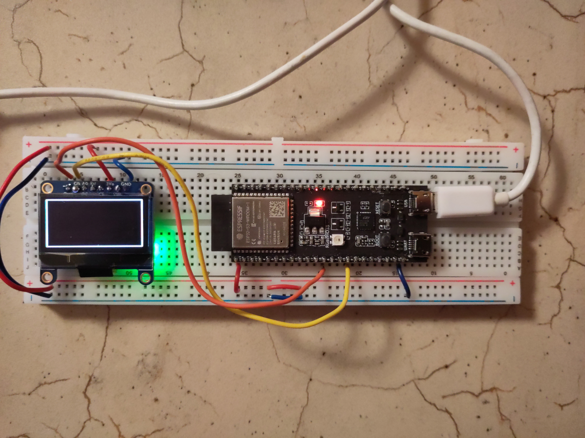
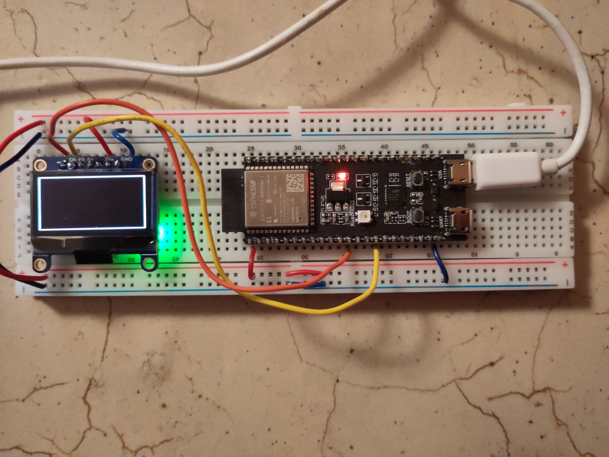

# ESP32-S3 × OLED SH1106 — Programmation bas niveau

Projet d'apprentissage : piloter un écran OLED Adafruit #938 (SH1106, 128×64px)
depuis un ESP32-S3 **sans bibliothèques externes**, en I2C, tout dans `main.cpp`.

---

## Matériel requis

| Composant | Référence |
|-----------|-----------|
| Microcontrôleur | ESP32-S3-WROOM-1 (DevKitC-1) |
| Écran OLED | Adafruit #938 (SH1106, 1.3", STEMMA QT) |


---

## Câblage

```
ESP32-S3       Adafruit #938
────────       ─────────────
3.3V    →      VIN
GND     →      GND
GPIO 8  →      DATA (SDA)
GPIO 9  →      CLK  (SCL)
```

> **Note** : l'adresse I2C de l'écran est **0x3D** (découverte par scan I2C).
> Le contrôleur est un **SH1106** (et non SSD1306 comme indiqué par Adafruit).

---

## Structure du projet

```
esp32-oled-sh1106/
├── platformio.ini  ← Configuration PlatformIO pour ESP32-S3
└── src/
    └── main.cpp    ← Tout le code : init, framebuffer, dessin
```

---

## Fonctions disponibles

| Fonction | Description |
|----------|-------------|
| `sh1106_init()` | Initialise le contrôleur SH1106 |
| `clear()` | Efface le framebuffer (écran noir) |
| `display()` | Envoie le framebuffer à l'écran via I2C |
| `set_pixel(x, y, on)` | Allume ou éteint un pixel |
| `draw_hline(x0, x1, y)` | Dessine une ligne horizontale |
| `draw_vline(x, y0, y1)` | Dessine une ligne verticale |
| `draw_rectangle(x0, x1, y0, y1)` | Dessine un rectangle vide |

---

## Concepts clés

### Le bus I2C
Deux fils partagés entre plusieurs composants :
- **DATA** (SDA) : les données
- **CLK** (SCL) : l'horloge

### L'octet de contrôle
- `0x00` → ce qui suit est une **commande**
- `0x40` → ce qui suit sont des **données** (pixels)

### La RAM du SH1106
L'écran est organisé en **8 pages** de 8 pixels de haut × 128 pixels de large.
Le SH1106 a une RAM de 132 colonnes — les pixels visibles commencent à la colonne 0.

### Le framebuffer
Copie en RAM de l'ESP32 de ce qui doit être affiché (1024 octets).
Flux de travail :
```
1. clear()         ← effacer le framebuffer
2. set_pixel(x, y) ← dessiner dans le framebuffer
3. display()       ← envoyer à l'écran
```

---

## Scanner l'adresse I2C

```cpp
#include <Arduino.h>
#include <Wire.h>

void setup() {
    Serial.begin(115200);
    Wire.begin(8, 9);
}

void loop() {
    for (uint8_t addr = 1; addr < 127; addr++) {
        Wire.beginTransmission(addr);
        uint8_t err = Wire.endTransmission();
        if (err == 0) {
            Serial.print("Appareil trouve a 0x");
            Serial.println(addr, HEX);
        }
    }
    delay(3000);
}
```

---

## Pour aller plus loin
- Dessiner des cercles (algorithme de Bresenham)
- Afficher des images bitmap
- Afficher du texte (police de caractères)
- Créer des animations


|||